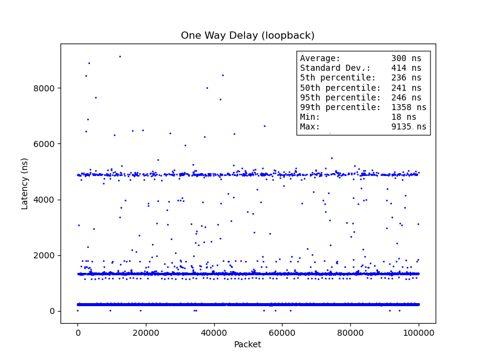
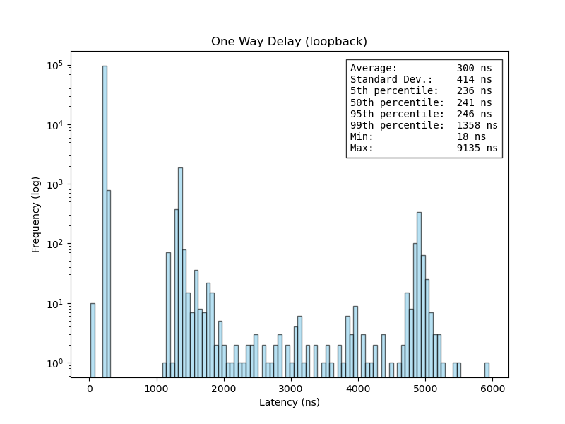

# (Under Construction)
# Low latency 40GB Ethernet soft core.
Designed for Stratix 10 series FPGAs
with the goal of achieving the absolute minimum latency possible.

### Motivation

I often use Ethernet to move test data between my PC and FPGA due to its simplicity and portability. Many of the FPGA boards I have access to include QSFP cages, and 40GbE NICs can be had for very cheap. Since I was going to build this Ethernet core anyway, I figured I would have fun with it and try to push the envelope. I can't increase the throughput, so instead I target latency.

### 40GbE and latency

The gold standard for low latency networking is 10GbE (citation needed). 40GbE is composed of four bonded 10GbE channels. However, the latency will always be worse with 40GbE due to the need to synchronize and align the four channels at the receiver. If you are targeting the absolute lowest latency possible, 25GbE is the next logical step, but you'll have to contend with FEC.

## Design

PMA -> Deserializer -/32-> PCS/CORE FIFO -/32-> Gearbox/Block Alignment -/66-> Descrambler -/66-> Decoder -/64-> MAC


## Testing Latency

### On-Chip Loopback
TODO

### Real World Latency

Since this is a real core that I actually use, I figured it made sense to see what sort of latency I could achieve with real signals originating off-chip.
Unfortunately, testing real world latency is non-trivial. I don't have access to professional networking characterization tools, so I did the best I could with a 40GB NIC on a standard computer running Linux.

Datapath: \
Host PC (tx) -> NIC -> 1M DAC -> FPGA PMA -> FPGA PCS/MAC (rx) \
                                             v \
Host PC (rx) <- NIC <- 1M DAC <- FPGA PMA <- FPGA MAC/PCS (tx)

### Testing one-way prop delay over 1 meter DAC cable

In order to isolate the latency of the FPGA interface, the total latency starting from the host machine to the end of the DAC cable must be measured and then subtracted from the overall round trip time.

You can measured this latency by plugging the 1M DAC cable into both ports of a dual-port 40GB NIC. To avoid nondeterminancies caused by kernel packet processing, hardware timestamping can be used to accurately determine when a packet leaves from and arrives at a network interface. These values can be used to calculate the delay a packet experiences as it travels through the network.

~~ One issue with this method is that the delay through the cable in the one way delay test will not match the delay in the FPGA loopback test. We could account for this by adding the expected propagation delay through a 1M DAC cable (~4ns), but as will be demonstrated later, this value is below the expected precision for this test.

To use hardware timestamping, your NIC must support hardware timestamps (I presume most 40GBe NICs do) \
You can check using the ethtool utility:

```
$ ethtool -T enp7s0
Time stamping parameters for enp7s0:
Capabilities:
	hardware-transmit
	software-transmit
	hardware-receive
	software-receive
	software-system-clock
	hardware-raw-clock
PTP Hardware Clock: 0
Hardware Transmit Timestamp Modes:
	off
	on
Hardware Receive Filter Modes:
	none
	all
```

The options to look for are `hardware-transmit` and `hardware-receive`

Once hardware timestamping has been enabled in the kernel, the NIC should generate timestamps any time it transmits or receives a [Precision Time Protocol](https://en.wikipedia.org/wiki/Precision_Time_Protocol) Sync packet. By sending a Sync packet from one interface to the other, the latency can be calculated by subtracting the RX timestamp from the TX timestamp.


The python script `utils/measure_loopback_latency.py` automates this process.
To use this script, edit the `INTERFACE1` and `INTERFACE2` constants to match the two ports on your NIC, and then run the script. After a few seconds, the results will be printed to the console and a timeseries plot will be saved to `loopback_timeseries.png`.

### Loopback delay results

These are the results form my test setup:





It is interesting that the latencies cluster around three main values (240ns, 1400ns, 4800ns). I expected a much more consistent value when using hardware timestamping. This is something I plan to investigate further. In the meantime, these results should be sufficient to produce accurate latency results for the Ethernet core.

### Testing total delay: host machine -> FPGA MAC (loopback) -> host machine
TODO
